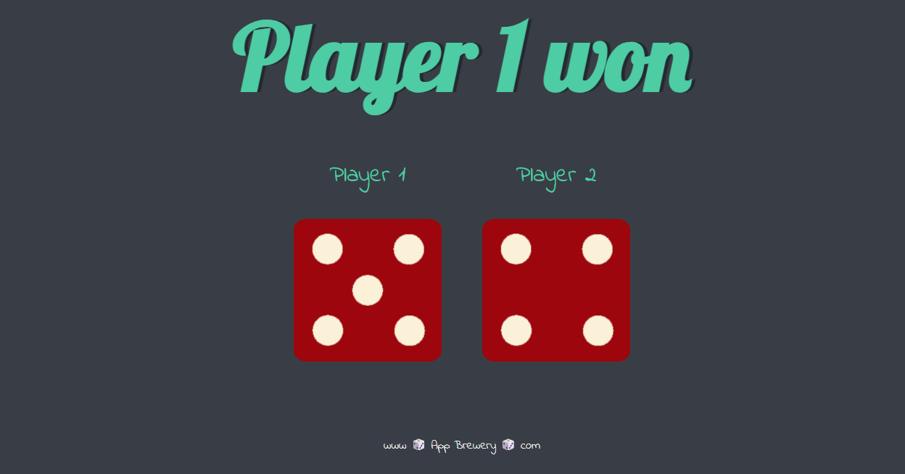

# 🎲 Dice Game

A simple **two-player dice game** built using **HTML, CSS, and JavaScript**.  
Players roll a dice, and the game displays which player wins or if it's a draw — complete with dice images.

---

## ✨ Features
- 🎯 **Random dice rolls** for both players (1–6)
- 🖼️ **Dynamic dice images** updated using the DOM
- 🏆 **Winner announcement** or draw message using `if...else if` logic
- ⚡ Instant results on every page refresh
- 💻 Simple, clean, beginner-friendly code

---

## 🛠️ Tech Stack
- **HTML5** – Structure of the game
- **CSS3** – Basic styling
- **JavaScript (ES6)** – Game logic and DOM manipulation

---